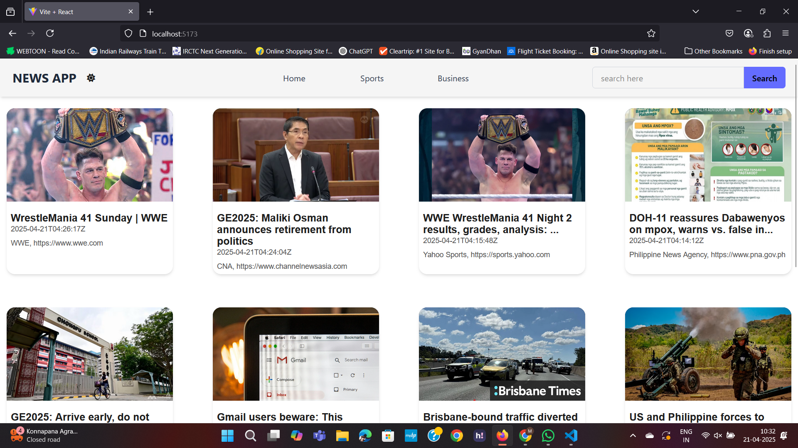
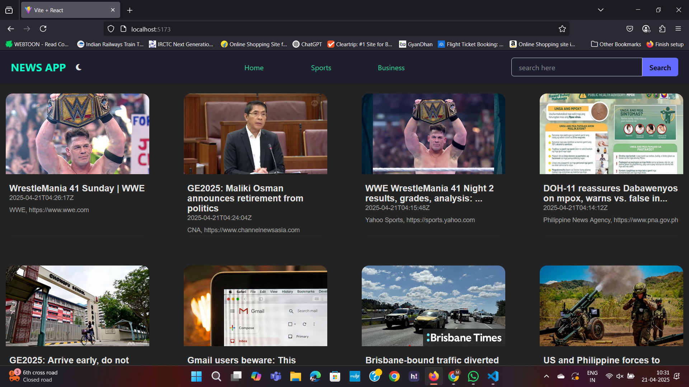
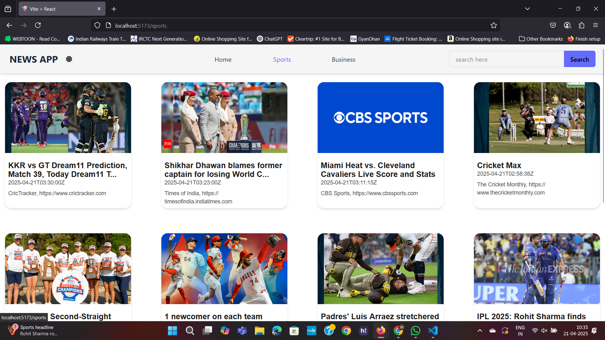
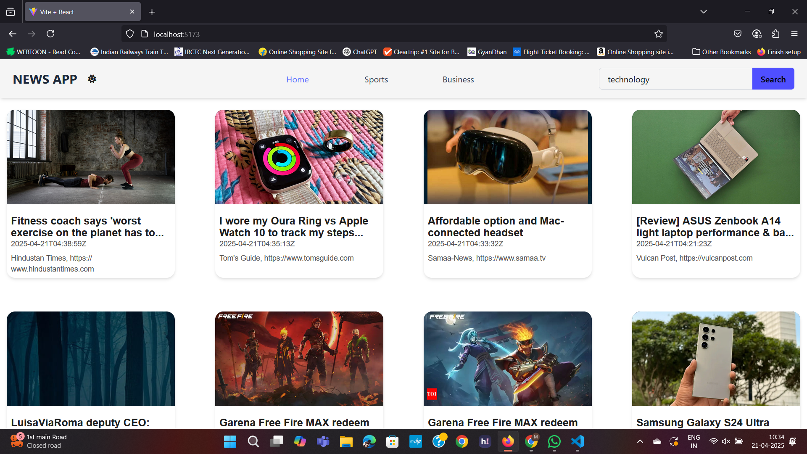

# 📰 NewsApp Web page

## 📄 Description

A responsive and modern news web page built with React that fetches real-time articles using the [GNews API](https://gnews.io/). The application delivers global headlines, category-specific stories, and a clean reading experience for users seeking the latest updates.

---

## ✨ Features

- 🌐 Real-time news fetching using GNews API
- 📱 Fully responsive design for desktop and mobile
- 🔍 Search functionality to find news by topic
- 🗂️ Filter news by category (e.g., World, Technology, Sports, Entertainment)
- 🧠 Clean UI with efficient use of React hooks (`useState`, `useEffect`, `useRef`)
- 🚀 Fast performance with minimal load times (uses `lazy loading`)

---

## 🖼️ Screenshots

> Located in the `./NewsApp/Screen_shots/` folder

| Homepage | Dark-themed View | Sports Page | Business Page | Search Results |
|----------|------------------|-------------|---------------|----------------|
|  |  |  |  |  |

---

## 🛠️ Tech Stack

- **Frontend**: React.js, JSX
- **Styling**: Tailwind CSS a.w.a Vanilla CSS (for theme-interactions)
- **API**: GNews API
- **State Management**: React Hooks
- **Build Tool**: Vite

---

## 📁 Folder Structure

./NewsApp/
│
├── public/                      
│
├── src/                         
│   ├── assets/                 
│   ├── components/              
│   ├── pages/                   
│   ├── contexts/                
│   ├── App.jsx                  
│   ├── main.jsx                
│   └── index.css                
│
├── Screen_shots/               
├── .gitignore                  
├── package.json                                
└── vite.config.js 

## 🚀 Setup Instructions

**Clone the repository**
   ```bash
   git clone https://github.com/ManavPratapSingh-off/Trimester3Project.git
   cd Trimester3Project/NewsApp | npm run dev

# React + Vite

This template provides a minimal setup to get React working in Vite with HMR and some ESLint rules.

Currently, two official plugins are available:

- [@vitejs/plugin-react](https://github.com/vitejs/vite-plugin-react/blob/main/packages/plugin-react) uses [Babel](https://babeljs.io/) for Fast Refresh
- [@vitejs/plugin-react-swc](https://github.com/vitejs/vite-plugin-react/blob/main/packages/plugin-react-swc) uses [SWC](https://swc.rs/) for Fast Refresh

## Expanding the ESLint configuration

If you are developing a production application, we recommend using TypeScript with type-aware lint rules enabled. Check out the [TS template](https://github.com/vitejs/vite/tree/main/packages/create-vite/template-react-ts) for information on how to integrate TypeScript and [`typescript-eslint`](https://typescript-eslint.io) in your project.
